# 🎧 DJ BATTLE SYSTEM - Sistema Completo de Batallas de DJs

## 📋 Índice
1. [Concepto General](#concepto-general)
2. [Modalidades por Género](#modalidades-por-género)
3. [Sistema de Sesiones Temporales](#sistema-de-sesiones-temporales)
4. [IA Judge - Evaluación Automática](#ia-judge---evaluación-automática)
5. [Análisis Técnico de Audio](#análisis-técnico-de-audio)
6. [Arquitectura del Sistema](#arquitectura-del-sistema)
7. [APIs y Endpoints](#apis-y-endpoints)
8. [Implementación Frontend](#implementación-frontend)
9. [Base de Datos](#base-de-datos)
10. [Algoritmos de Evaluación](#algoritmos-de-evaluación)

---

## 🎯 Concepto General

### **Battle Format**
- **Formato**: 1v1 DJ battles en tiempo real
- **Duración**: Cada DJ sube **6 canciones** a una sesión temporal
- **Set Final**: **12 canciones** total (6 de cada DJ alternando)
- **Tiempo Límite**: 6 horas para completar el battle
- **Evaluación**: IA Judge analiza técnica de mixing en tiempo real

### **Objetivo**
Evaluar la **habilidad técnica real** de los DJs en:
- **Beatmatching** preciso
- **Transiciones** suaves
- **Control de pitch** y timing
- **Compatibilidad musical** (keys, géneros)
- **Creatividad** y flow

---

## 🎵 Modalidades por Género

### 🔰 **NIVEL PRINCIPIANTE**

#### **🌴 Tropical House Battle**
```json
{
  "genre": "tropical_house",
  "bpm_range": [100, 115],
  "typical_bpm": 110,
  "difficulty": "beginner",
  "tolerance_bpm": 5,
  "time_signature": "4/4",
  "mixing_style": "melodic_smooth",
  "battle_duration": "30_minutes",
  "scoring_weight": {
    "technical_precision": 30,
    "transition_quality": 40,
    "musical_compatibility": 20,
    "creativity": 10
  }
}
```

#### **🏠 Classic House Battle**
```json
{
  "genre": "classic_house",
  "bpm_range": [120, 130],
  "typical_bpm": 125,
  "difficulty": "beginner",
  "tolerance_bpm": 3,
  "time_signature": "4/4",
  "mixing_style": "groove_focused",
  "battle_duration": "30_minutes"
}
```

### 🔵 **NIVEL INTERMEDIO**

#### **⚡ Tech House Precision**
```json
{
  "genre": "tech_house",
  "bpm_range": [125, 130],
  "typical_bpm": 128,
  "difficulty": "intermediate",
  "tolerance_bpm": 2,
  "time_signature": "4/4",
  "mixing_style": "technical_precise",
  "required_techniques": ["loop_rolling", "effects_usage", "layering"],
  "battle_duration": "45_minutes",
  "scoring_weight": {
    "technical_precision": 40,
    "transition_quality": 30,
    "musical_compatibility": 20,
    "creativity": 10
  }
}
```

#### **🎯 Dubstep Dynamics**
```json
{
  "genre": "dubstep",
  "bpm_range": [135, 145],
  "typical_bpm": 140,
  "difficulty": "intermediate",
  "tolerance_bpm": 1,
  "time_signature": "4/4_half_time",
  "mixing_style": "space_and_silence",
  "required_techniques": ["drop_timing", "energy_control", "buildup_mastery"],
  "battle_duration": "45_minutes"
}
```

### 🔴 **NIVEL AVANZADO**

#### **🚀 Drum & Bass Technical**
```json
{
  "genre": "drum_and_bass",
  "bpm_range": [170, 180],
  "typical_bpm": 174,
  "difficulty": "advanced",
  "tolerance_bpm": 2,
  "time_signature": "4/4_complex_breaks",
  "mixing_style": "high_speed_precision",
  "required_techniques": ["rewinds", "air_horns", "break_matching", "double_drops"],
  "battle_duration": "60_minutes",
  "scoring_weight": {
    "technical_precision": 50,
    "transition_quality": 25,
    "musical_compatibility": 15,
    "creativity": 10
  }
}
```

#### **🌀 Industrial Techno**
```json
{
  "genre": "industrial_techno",
  "bpm_range": [140, 160],
  "typical_bpm": 150,
  "difficulty": "advanced",
  "tolerance_bpm": 2,
  "time_signature": "4/4",
  "mixing_style": "dark_atmospheric",
  "required_techniques": ["layering", "atmosphere_building", "energy_progression"],
  "battle_duration": "60_minutes"
}
```

### ⚫ **NIVEL EXPERTO**

#### **🔥 Hardcore Endurance**
```json
{
  "genre": "hardcore_gabber",
  "bpm_range": [160, 200],
  "typical_bpm": 180,
  "difficulty": "expert",
  "tolerance_bpm": 1,
  "time_signature": "4/4",
  "mixing_style": "extreme_precision",
  "required_techniques": ["extreme_speed_mixing", "endurance", "crowd_control"],
  "battle_duration": "90_minutes",
  "scoring_weight": {
    "technical_precision": 60,
    "transition_quality": 20,
    "musical_compatibility": 10,
    "creativity": 10
  }
}
```

#### **🎪 Freestyle Multi-Género**
```json
{
  "genre": "freestyle_multi",
  "bpm_range": [80, 200],
  "typical_bpm": "variable",
  "difficulty": "master",
  "tolerance_bpm": "adaptive",
  "time_signature": "mixed",
  "mixing_style": "creative_fusion",
  "required_techniques": ["genre_blending", "bpm_manipulation", "creative_transitions"],
  "battle_duration": "90_minutes",
  "special_rules": ["any_genre_allowed", "creative_mashups_encouraged", "innovation_bonus"]
}
```

---

## ⏱️ Sistema de Sesiones Temporales

### **Arquitectura de Sesiones**
```javascript
// Modelo de Sesión Temporal
const BattleSession = {
  id: 'battle_session_uuid',
  created_at: timestamp,
  expires_at: timestamp + (6 * 60 * 60 * 1000), // 6 horas
  status: 'waiting_for_uploads', // waiting_for_uploads, ready_to_battle, in_progress, completed, expired
  
  // Configuración del Battle
  battle_config: {
    genre: 'tech_house',
    difficulty: 'intermediate',
    max_songs_per_dj: 6,
    total_battle_duration: 45, // minutos
    mixing_rules: {
      bpm_tolerance: 2,
      required_techniques: ['loop_rolling', 'effects_usage'],
      forbidden_techniques: ['air_horns'] // según género
    }
  },
  
  // Participantes
  participants: [
    {
      dj_id: 'dj_1_uuid',
      username: 'TechMasterDJ',
      songs: [
        {
          id: 'song_1_uuid',
          filename: 'track_01.mp3',
          upload_timestamp: timestamp,
          audio_analysis: {
            bpm: 128.5,
            key: 'A_minor',
            duration: 245, // segundos
            energy_level: 0.8,
            genre_confidence: 0.95
          }
        }
        // ... 5 more songs
      ],
      upload_complete: false,
      ready_status: false
    },
    {
      dj_id: 'dj_2_uuid',
      username: 'BasslineKing',
      songs: [],
      upload_complete: false,
      ready_status: false
    }
  ],
  
  // Orden de Mixing (se genera automáticamente)
  mixing_order: [
    { position: 1, dj_id: 'dj_1_uuid', song_index: 0 },
    { position: 2, dj_id: 'dj_2_uuid', song_index: 0 },
    { position: 3, dj_id: 'dj_1_uuid', song_index: 1 },
    // ... alternando hasta 12 canciones
  ],
  
  // Estado del Battle
  battle_state: {
    current_position: 0,
    start_time: null,
    end_time: null,
    current_song: null,
    transition_analysis: []
  }
};
```

### **Flujo de Sesión**

```mermaid
graph TD
    A[Crear Battle Session] --> B[DJs Suben 6 Canciones c/u]
    B --> C[Análisis de Audio Automático]
    C --> D[Validación de Género y BPM]
    D --> E[Generación de Orden de Mixing]
    E --> F[Battle Listo - Estado: Ready]
    F --> G[Inicio del Battle]
    G --> H[IA Judge Evalúa en Tiempo Real]
    H --> I[Finalización y Resultados]
    I --> J[Limpieza de Archivos Temporales]
```


---

## 🤖 IA Judge - Evaluación Automática

### **Arquitectura del IA Judge**
```javascript
class DJBattleJudge {
  constructor(genre_config) {
    this.genre = genre_config.genre;
    this.bpm_tolerance = genre_config.tolerance_bpm;
    this.required_techniques = genre_config.required_techniques;
    this.scoring_weights = genre_config.scoring_weight;
    
    // Modelos de IA especializados
    this.models = {
      bpm_analyzer: new RealTimeBPMAnalyzer(),
      pitch_detector: new PitchDetector(),
      transition_analyzer: new TransitionAnalyzer(),
      genre_classifier: new GenreClassifier(),
      creativity_scorer: new CreativityScorer()
    };
  }

  async evaluateBattle(battle_session) {
    const evaluation = {
      battle_id: battle_session.id,
      genre: this.genre,
      participants: [],
      overall_quality: 0,
      technical_analysis: {},
      recommendations: []
    };

    // Análisis por participante
    for (let participant of battle_session.participants) {
      const dj_score = await this.evaluateDJPerformance(
        participant, 
        battle_session.mixing_order
      );
      evaluation.participants.push(dj_score);
    }

    // Análisis global del set
    evaluation.technical_analysis = await this.analyzeOverallSet(battle_session);
    evaluation.overall_quality = this.calculateOverallQuality(evaluation);
    
    return evaluation;
  }

  async evaluateDJPerformance(dj_data, mixing_order) {
    const performance = {
      dj_id: dj_data.dj_id,
      username: dj_data.username,
      scores: {
        technical_precision: 0,
        transition_quality: 0,
        musical_compatibility: 0,
        creativity: 0,
        total: 0
      },
      detailed_analysis: {
        bpm_accuracy: [],
        transition_analysis: [],
        key_compatibility: [],
        timing_errors: [],
        creative_techniques: []
      }
    };

    // Obtener las transiciones que maneja este DJ
    const dj_transitions = this.getDJTransitions(dj_data.dj_id, mixing_order);

    for (let transition of dj_transitions) {
      const analysis = await this.analyzeTransition(transition);
      performance.detailed_analysis.transition_analysis.push(analysis);
    }

    // Calcular scores
    performance.scores = this.calculateScores(performance.detailed_analysis);
    
    return performance;
  }

  async analyzeTransition(transition) {
    const { from_song, to_song, transition_point, transition_duration } = transition;
    
    // Análisis técnico detallado
    const analysis = {
      transition_id: transition.id,
      from_song_id: from_song.id,
      to_song_id: to_song.id,
      
      // Análisis de BPM
      bpm_analysis: {
        from_bpm: await this.models.bpm_analyzer.analyze(from_song.audio_buffer),
        to_bpm: await this.models.bpm_analyzer.analyze(to_song.audio_buffer),
        bpm_difference: 0,
        bpm_match_quality: 0, // 0-1 score
        tempo_drift: [] // cambios de tempo durante la transición
      },
      
      // Análisis de Pitch
      pitch_analysis: {
        key_compatibility: await this.analyzeKeyCompatibility(from_song, to_song),
        pitch_errors: await this.detectPitchErrors(transition_point, transition_duration),
        harmonic_match: 0 // 0-1 score
      },
      
      // Análisis de Transición
      transition_analysis: {
        crossfade_quality: await this.analyzeCrossfade(transition_point, transition_duration),
        energy_flow: await this.analyzeEnergyFlow(from_song, to_song),
        timing_precision: await this.analyzeTimingPrecision(transition),
        smoothness_score: 0 // 0-1 score
      },
      
      // Creatividad
      creativity_analysis: {
        techniques_used: await this.detectCreativeTechniques(transition),
        originality_score: 0, // 0-1 score
        crowd_impact: 0 // predicción de reacción del público
      },
      
      // Errores detectados
      errors: {
        timing_errors: [],
        pitch_errors: [],
        technical_errors: [],
        flow_interruptions: []
      }
    };

    // Calcular scores específicos
    analysis.bpm_analysis.bpm_difference = Math.abs(
      analysis.bpm_analysis.from_bpm - analysis.bmp_analysis.to_bpm
    );
    
    analysis.bpm_analysis.bpm_match_quality = this.calculateBPMMatchQuality(
      analysis.bpm_analysis.bpm_difference
    );

    return analysis;
  }

  calculateBPMMatchQuality(bpm_difference) {
    // Función de scoring basada en tolerancia del género
    if (bpm_difference <= this.bpm_tolerance) {
      return 1.0; // Perfecto
    } else if (bmp_difference <= this.bpm_tolerance * 2) {
      return 0.7; // Aceptable
    } else if (bpm_difference <= this.bpm_tolerance * 3) {
      return 0.4; // Pobre
    } else {
      return 0.1; // Muy pobre
    }
  }

  async detectPitchErrors(transition_point, duration) {
    const errors = [];
    
    // Análisis frame por frame durante la transición
    const frames = this.segmentAudio(transition_point, duration, 0.1); // 100ms frames
    
    for (let frame of frames) {
      const pitch_data = await this.models.pitch_detector.analyze(frame);
      
      if (pitch_data.is_unstable) {
        errors.push({
          timestamp: frame.timestamp,
          type: 'pitch_instability',
          severity: pitch_data.instability_level,
          description: 'Pitch fluctuation detected'
        });
      }
      
      if (pitch_data.is_off_key) {
        errors.push({
          timestamp: frame.timestamp,
          type: 'key_clash',
          severity: pitch_data.dissonance_level,
          description: 'Key incompatibility detected'
        });
      }
    }
    
    return errors;
  }

  async analyzeKeyCompatibility(from_song, to_song) {
    const from_key = await this.detectMusicalKey(from_song);
    const to_key = await this.detectMusicalKey(to_song);
    
    // Círculo de quintas y compatibilidad harmónica
    const compatibility_matrix = {
      'C_major': ['C_major', 'G_major', 'F_major', 'A_minor', 'E_minor', 'D_minor'],
      'G_major': ['G_major', 'D_major', 'C_major', 'E_minor', 'B_minor', 'A_minor'],
      // ... resto de la matriz
    };
    
    const is_compatible = compatibility_matrix[from_key]?.includes(to_key) || false;
    const compatibility_score = is_compatible ? 1.0 : this.calculateDissonanceScore(from_key, to_key);
    
    return {
      from_key,
      to_key,
      is_compatible,
      compatibility_score,
      recommended_keys: compatibility_matrix[from_key] || []
    };
  }

  async detectCreativeTechniques(transition) {
    const techniques = [];
    const audio_segment = this.extractTransitionAudio(transition);
    
    // Detectar técnicas específicas del género
    if (this.genre === 'drum_and_bass') {
      // Rewinds
      if (await this.detectRewind(audio_segment)) {
        techniques.push({ type: 'rewind', timestamp: transition.start_time });
      }
      
      // Air horns
      if (await this.detectAirHorn(audio_segment)) {
        techniques.push({ type: 'air_horn', timestamp: transition.start_time });
      }
      
      // Double drops
      if (await this.detectDoubleDrop(audio_segment)) {
        techniques.push({ type: 'double_drop', timestamp: transition.start_time });
      }
    }
    
    if (this.genre === 'tech_house') {
      // Loop rolling
      if (await this.detectLoopRolling(audio_segment)) {
        techniques.push({ type: 'loop_rolling', timestamp: transition.start_time });
      }
      
      // Filter sweeps
      if (await this.detectFilterSweep(audio_segment)) {
        techniques.push({ type: 'filter_sweep', timestamp: transition.start_time });
      }
    }
    
    // Técnicas universales
    if (await this.detectEchoOut(audio_segment)) {
      techniques.push({ type: 'echo_out', timestamp: transition.start_time });
    }
    
    return techniques;
  }
}
```

---

## 🔊 Análisis Técnico de Audio

### **Librerías y Tecnologías**
```json
{
  "audio_analysis": {
    "realtime_bpm_analyzer": "^2.0.0",
    "pitchfinder": "^3.0.0",
    "music-tempo": "^2.1.0",
    "tone": "^14.7.77",
    "essentia.js": "^0.1.3",
    "@tensorflow/tfjs-node": "^4.10.0"
  },
  "file_processing": {
    "multer": "^1.4.5",
    "fluent-ffmpeg": "^2.1.2",
    "node-wav": "^0.0.2",
    "audio-buffer": "^5.0.0"
  },
  "machine_learning": {
    "@tensorflow/tfjs": "^4.10.0",
    "ml-matrix": "^6.10.4",
    "simple-statistics": "^7.8.2"
  }
}
```

### **Pipeline de Análisis**
```javascript
class AudioAnalyzer {
  constructor() {
    this.initializeAnalyzers();
  }

  async initializeAnalyzers() {
    // Inicializar analizadores especializados
    this.bpm_analyzer = new RealTimeBPMAnalyzer({
      continuousAnalysis: true,
      stabilizationTime: 10000 // 10 segundos
    });
    
    this.pitch_detector = Pitchfinder.YIN({
      sampleRate: 44100,
      threshold: 0.1
    });
    
    this.genre_classifier = await this.loadGenreModel();
    this.key_detector = new KeyDetector();
  }

  async analyzeUploadedSong(audio_buffer, metadata) {
    const analysis = {
      basic_info: {
        filename: metadata.filename,
        duration: audio_buffer.duration,
        sample_rate: audio_buffer.sampleRate,
        channels: audio_buffer.numberOfChannels
      },
      
      tempo_analysis: await this.analyzeTempo(audio_buffer),
      pitch_analysis: await this.analyzePitch(audio_buffer),
      genre_analysis: await this.analyzeGenre(audio_buffer),
      energy_analysis: await this.analyzeEnergy(audio_buffer),
      structure_analysis: await this.analyzeStructure(audio_buffer)
    };

    return analysis;
  }

  async analyzeTempo(audio_buffer) {
    // Análisis de tempo detallado
    const tempo_analyzer = new MusicTempo(audio_buffer);
    
    return {
      bpm: tempo_analyzer.tempo,
      beats: tempo_analyzer.beats, // posiciones de beats en segundos
      tempo_stability: this.calculateTempoStability(tempo_analyzer.beats),
      tempo_changes: this.detectTempoChanges(tempo_analyzer.beats),
      confidence: tempo_analyzer.confidence || 0.8
    };
  }

  async analyzePitch(audio_buffer) {
    const pitch_data = [];
    const segment_size = 4096; // tamaño de ventana
    
    // Análizar por segmentos
    for (let i = 0; i < audio_buffer.length; i += segment_size) {
      const segment = audio_buffer.getChannelData(0).slice(i, i + segment_size);
      const pitch = this.pitch_detector(segment);
      
      if (pitch && pitch > 80 && pitch < 2000) { // rango válido
        pitch_data.push({
          timestamp: i / audio_buffer.sampleRate,
          frequency: pitch,
          note: this.frequencyToNote(pitch)
        });
      }
    }

    return {
      detected_key: await this.detectOverallKey(pitch_data),
      pitch_stability: this.calculatePitchStability(pitch_data),
      pitch_range: {
        min: Math.min(...pitch_data.map(p => p.frequency)),
        max: Math.max(...pitch_data.map(p => p.frequency))
      },
      harmonic_content: await this.analyzeHarmonics(audio_buffer)
    };
  }

  async analyzeGenre(audio_buffer) {
    // Extraer características para clasificación de género
    const features = await this.extractGenreFeatures(audio_buffer);
    const prediction = await this.genre_classifier.predict(features);
    
    return {
      predicted_genre: prediction.genre,
      confidence: prediction.confidence,
      subgenre_scores: prediction.subgenre_scores,
      features: {
        spectral_centroid: features.spectral_centroid,
        zero_crossing_rate: features.zero_crossing_rate,
        mfcc: features.mfcc,
        chroma: features.chroma,
        spectral_rolloff: features.spectral_rolloff
      }
    };
  }

  async analyzeEnergy(audio_buffer) {
    const rms_values = [];
    const segment_size = 2048;
    
    // Calcular RMS por segmentos
    for (let i = 0; i < audio_buffer.length; i += segment_size) {
      const segment = audio_buffer.getChannelData(0).slice(i, i + segment_size);
      const rms = Math.sqrt(segment.reduce((sum, val) => sum + val * val, 0) / segment.length);
      rms_values.push(rms);
    }

    return {
      overall_energy: rms_values.reduce((sum, val) => sum + val, 0) / rms_values.length,
      energy_curve: rms_values,
      peak_energy: Math.max(...rms_values),
      energy_variation: this.calculateEnergyVariation(rms_values),
      energy_drops: this.detectEnergyDrops(rms_values),
      energy_builds: this.detectEnergyBuilds(rms_values)
    };
  }

  async analyzeStructure(audio_buffer) {
    // Análisis de estructura de la canción
    const beats = await this.detectBeats(audio_buffer);
    const sections = await this.detectSections(audio_buffer);
    
    return {
      total_beats: beats.length,
      sections: sections, // intro, verse, chorus, break, outro
      breakdown_points: this.detectBreakdowns(audio_buffer),
      drop_points: this.detectDrops(audio_buffer),
      suitable_mix_points: this.findMixPoints(audio_buffer, beats)
    };
  }

  findMixPoints(audio_buffer, beats) {
    const mix_points = [];
    
    // Buscar puntos ideales para mezclar (típicamente cada 16 o 32 beats)
    for (let i = 16; i < beats.length; i += 16) {
      const timestamp = beats[i];
      const energy_level = this.getEnergyAtTime(audio_buffer, timestamp);
      const harmonic_stability = this.getHarmonicStabilityAtTime(audio_buffer, timestamp);
      
      mix_points.push({
        timestamp,
        beat_number: i,
        energy_level,
        harmonic_stability,
        suitability_score: (energy_level + harmonic_stability) / 2
      });
    }
    
    // Ordenar por suitability score
    return mix_points.sort((a, b) => b.suitability_score - a.suitability_score);
  }
}
```

---

## 🏗️ Arquitectura del Sistema

### **Stack Tecnológico**
```yaml
Backend:
  - Node.js 18+
  - Express.js
  - PostgreSQL (battle sessions, user data)
  - Redis (real-time data, session cache)
  - Socket.IO (real-time battles)
  - TensorFlow.js (IA models)
  - FFmpeg (audio processing)

Frontend:
  - Angular 17
  - TailwindCSS
  - Three.js (3D visualizations)
  - Web Audio API
  - Socket.IO Client
  - RxJS (reactive streams)

Audio Processing:
  - Web Audio API
  - Tone.js
  - Pitchfinder
  - Music-Tempo
  - Essentia.js

Machine Learning:
  - TensorFlow.js
  - Pre-trained audio models
  - Custom DJ evaluation models
  - Real-time inference

Storage:
  - AWS S3 (audio files)
  - Local temp storage (battle sessions)
  - Redis (session state)
  - PostgreSQL (persistent data)
```

### **Microservicios**
```yaml
Services:
  api-gateway:
    port: 3000
    responsibilities: [routing, authentication, rate-limiting]
    
  battle-service:
    port: 3001  
    responsibilities: [session management, battle logic]
    
  audio-analysis-service:
    port: 3002
    responsibilities: [BPM detection, pitch analysis, genre classification]
    
  ai-judge-service:
    port: 3003
    responsibilities: [performance evaluation, scoring, recommendations]
    
  file-processing-service:
    port: 3004
    responsibilities: [upload handling, format conversion, temp storage]
    
  websocket-service:
    port: 3005
    responsibilities: [real-time communication, battle updates]
    
  notification-service:
    port: 3006
    responsibilities: [battle invites, results, alerts]
```

---

## 📡 APIs y Endpoints

### **Battle Session Management**
```javascript
// POST /api/battles/sessions
// Crear nueva sesión de battle
router.post('/sessions', async (req, res) => {
  const { genre, difficulty, opponent_id } = req.body;
  
  const session = await BattleSession.create({
    creator_id: req.user.id,
    opponent_id,
    genre,
    difficulty,
    expires_at: new Date(Date.now() + 6 * 60 * 60 * 1000), // 6 horas
    status: 'waiting_for_uploads'
  });
  
  res.json({ session_id: session.id, upload_url: `/api/battles/sessions/${session.id}/upload` });
});

// POST /api/battles/sessions/:id/upload
// Subir canciones a la sesión
router.post('/sessions/:id/upload', upload.array('songs', 6), async (req, res) => {
  const session = await BattleSession.findById(req.params.id);
  
  if (!session || session.isExpired()) {
    return res.status(400).json({ error: 'Session expired or not found' });
  }
  
  // Procesar archivos de audio
  const processed_songs = [];
  for (let file of req.files) {
    const analysis = await AudioAnalyzer.analyze(file.buffer);
    
    // Validar género y BPM
    const validation = await validateSongForGenre(analysis, session.genre);
    if (!validation.valid) {
      return res.status(400).json({ 
        error: `Song ${file.originalname} doesn't match genre requirements`,
        details: validation.errors 
      });
    }
    
    processed_songs.push({
      filename: file.originalname,
      analysis,
      upload_timestamp: new Date()
    });
  }
  
  // Actualizar sesión
  await session.addSongs(req.user.id, processed_songs);
  
  res.json({ 
    message: 'Songs uploaded successfully',
    songs_count: processed_songs.length,
    session_ready: session.isReadyToBattle()
  });
});

// POST /api/battles/sessions/:id/start
// Iniciar battle
router.post('/sessions/:id/start', async (req, res) => {
  const session = await BattleSession.findById(req.params.id);
  
  if (!session.isReadyToBattle()) {
    return res.status(400).json({ error: 'Session not ready to start' });
  }
  
  // Generar orden de mixing
  const mixing_order = generateMixingOrder(session.participants);
  session.mixing_order = mixing_order;
  session.status = 'in_progress';
  session.start_time = new Date();
  
  await session.save();
  
  // Notificar a ambos DJs via WebSocket
  io.to(`battle_${session.id}`).emit('battle_started', {
    session_id: session.id,
    mixing_order,
    current_position: 0
  });
  
  res.json({ message: 'Battle started', mixing_order });
});

// GET /api/battles/sessions/:id/status
// Obtener estado del battle en tiempo real
router.get('/sessions/:id/status', async (req, res) => {
  const session = await BattleSession.findById(req.params.id);
  const current_analysis = await AIJudge.getCurrentAnalysis(session.id);
  
  res.json({
    session_id: session.id,
    status: session.status,
    current_position: session.battle_state.current_position,
    current_song: session.battle_state.current_song,
    real_time_scores: current_analysis.real_time_scores,
    transition_quality: current_analysis.transition_quality,
    remaining_time: session.getRemainingTime()
  });
});
```

### **AI Judge Endpoints**
```javascript
// GET /api/ai-judge/analysis/:battle_id
// Obtener análisis completo del battle
router.get('/analysis/:battle_id', async (req, res) => {
  const analysis = await AIJudge.getCompleteAnalysis(req.params.battle_id);
  
  res.json({
    battle_id: req.params.battle_id,
    overall_scores: analysis.overall_scores,
    detailed_analysis: analysis.detailed_analysis,
    technical_breakdown: analysis.technical_breakdown,
    recommendations: analysis.recommendations,
    winner: analysis.winner,
    margin_of_victory: analysis.margin_of_victory
  });
});

// POST /api/ai-judge/real-time-feedback
// Feedback en tiempo real durante el battle
router.post('/real-time-feedback', async (req, res) => {
  const { battle_id, current_transition } = req.body;
  
  const feedback = await AIJudge.analyzeCurrentTransition(battle_id, current_transition);
  
  // Enviar feedback via WebSocket
  io.to(`battle_${battle_id}`).emit('real_time_feedback', feedback);
  
  res.json({ status: 'feedback_sent', feedback });
});

// GET /api/ai-judge/training-data
// Obtener datos para entrenar modelos
router.get('/training-data', adminAuth, async (req, res) => {
  const training_data = await AIJudge.exportTrainingData();
  
  res.json({
    battles_analyzed: training_data.battles_count,
    transitions_analyzed: training_data.transitions_count,
    features: training_data.features,
    labels: training_data.labels,
    export_timestamp: new Date()
  });
});
```

### **WebSocket Events**
```javascript
// Real-time battle events
io.on('connection', (socket) => {
  
  // Join battle room
  socket.on('join_battle', (battle_id) => {
    socket.join(`battle_${battle_id}`);
    console.log(`DJ joined battle ${battle_id}`);
  });
  
  // Song transition started
  socket.on('transition_started', async (data) => {
    const { battle_id, from_song, to_song, timestamp } = data;
    
    // Iniciar análisis en tiempo real
    AIJudge.startTransitionAnalysis(battle_id, {
      from_song,
      to_song, 
      start_timestamp: timestamp
    });
    
    // Notificar a espectadores
    io.to(`battle_${battle_id}`).emit('transition_update', {
      type: 'transition_started',
      from_song,
      to_song,
      timestamp
    });
  });
  
  // Song transition completed
  socket.on('transition_completed', async (data) => {
    const { battle_id, transition_id, end_timestamp } = data;
    
    // Finalizar análisis y obtener resultados
    const analysis = await AIJudge.completeTransitionAnalysis(battle_id, transition_id, end_timestamp);
    
    // Enviar resultados inmediatos
    io.to(`battle_${battle_id}`).emit('transition_results', {
      transition_id,
      scores: analysis.scores,
      technical_feedback: analysis.technical_feedback,
      errors_detected: analysis.errors,
      improvement_tips: analysis.recommendations
    });
  });
  
  // Battle completed
  socket.on('battle_completed', async (battle_id) => {
    const final_analysis = await AIJudge.getFinalResults(battle_id);
    
    io.to(`battle_${battle_id}`).emit('battle_results', {
      winner: final_analysis.winner,
      final_scores: final_analysis.scores,
      battle_highlights: final_analysis.highlights,
      detailed_breakdown: final_analysis.breakdown,
      next_actions: {
        rematch: true,
        share_results: true,
        view_analysis: true
      }
    });
    
    // Limpiar archivos temporales
    await cleanupBattleFiles(battle_id);
  });
  
  // Real-time audio streaming (optional)  
  socket.on('audio_stream', (audio_data) => {
    // Procesar audio en tiempo real para análisis instantáneo
    AIJudge.processAudioStream(socket.battle_id, audio_data);
  });
  
});
```

---

## 🎨 Implementación Frontend

### **Battle Component (Angular)**
```typescript
// battle.component.ts
@Component({
  selector: 'app-battle',
  templateUrl: './battle.component.html',
  styleUrls: ['./battle.component.scss']
})
export class BattleComponent implements OnInit, OnDestroy {
  @Input() battleId: string;
  
  battle$: Observable<BattleSession>;
  realTimeAnalysis$: Observable<AIAnalysis>;
  audioContext: AudioContext;
  currentTransition: TransitionData;
  
  // WebSocket connection
  private socket: Socket;
  
  constructor(
    private battleService: BattleService,
    private aiJudgeService: AIJudgeService,
    private socketService: SocketService,
    private audioService: AudioService
  ) {
    this.socket = this.socketService.getSocket();
  }

  ngOnInit() {
    this.initializeAudioContext();
    this.connectToRelTimeBattle();
    this.subscribeToWebSocketEvents();
  }

  private initializeAudioContext() {
    this.audioContext = new AudioContext();
    
    // Setup Web Audio API for real-time analysis
    this.audioService.setupRealTimeAnalysis(this.audioContext);
  }

  private connectToRealTimeBattle() {
    this.socket.emit('join_battle', this.battleId);
    
    // Subscribe to battle state
    this.battle$ = this.battleService.getBattleStatus(this.battleId);
    
    // Subscribe to real-time AI analysis
    this.realTimeAnalysis$ = this.aiJudgeService.getRealTimeAnalysis(this.battleId);
  }

  private subscribeToWebSocketEvents() {
    // Battle started
    this.socket.on('battle_started', (data) => {
      this.startBattleVisualization(data);
    });
    
    // Real-time feedback from AI Judge
    this.socket.on('real_time_feedback', (feedback) => {
      this.displayRealTimeFeedback(feedback);
    });
    
    // Transition results
    this.socket.on('transition_results', (results) => {
      this.showTransitionResults(results);
    });
    
    // Final battle results
    this.socket.on('battle_results', (results) => {
      this.showFinalResults(results);
    });
  }

  onTransitionStart(fromSong: Song, toSong: Song) {
    const transitionData = {
      battle_id: this.battleId,
      from_song: fromSong,
      to_song: toSong,
      timestamp: Date.now()
    };
    
    this.socket.emit('transition_started', transitionData);
    this.currentTransition = transitionData;
    
    // Start visual transition analysis
    this.startTransitionVisualization();
  }

  private startTransitionVisualization() {
    // Real-time waveform visualization
    this.audioService.startWaveformVisualization();
    
    // BPM matching indicator
    this.showBPMMatchingIndicator();
    
    // Key compatibility display
    this.showKeyCompatibilityIndicator();
  }

  private displayRealTimeFeedback(feedback: AIFeedback) {
    // Update UI with real-time scores
    this.updateScoreDisplay(feedback.scores);
    
    // Show technical feedback
    this.showTechnicalFeedback(feedback.technical_analysis);
    
    // Display errors/warnings
    if (feedback.errors.length > 0) {
      this.showErrorsPanel(feedback.errors);
    }
    
    // Show improvement tips
    if (feedback.recommendations.length > 0) {
      this.showRecommendationsPanel(feedback.recommendations);
    }
  }
}
```

### **Audio Upload Component**
```typescript
// audio-upload.component.ts
@Component({
  selector: 'app-audio-upload',
  template: `
    <div class="upload-container">
      <div class="drop-zone" 
           (drop)="onFileDrop($event)" 
           (dragover)="onDragOver($event)"
           [class.drag-active]="isDragActive">
        
        <div class="upload-icon">
          <svg><!-- Music note icon --></svg>
        </div>
        
        <h3>Drop your 6 songs here</h3>
        <p>Or click to browse files</p>
        
        <input type="file" 
               #fileInput 
               multiple 
               accept="audio/*"
               (change)="onFileSelect($event)"
               style="display: none;">
        
        <button (click)="fileInput.click()" class="browse-btn">
          Browse Files
        </button>
      </div>
      
      <div class="uploaded-files" *ngIf="uploadedFiles.length > 0">
        <div class="file-item" *ngFor="let file of uploadedFiles; trackBy: trackByFile">
          <div class="file-info">
            <span class="filename">{{ file.name }}</span>
            <span class="file-size">{{ file.size | fileSize }}</span>
          </div>
          
          <div class="file-analysis" *ngIf="file.analysis">
            <div class="analysis-item">
              <label>BPM:</label>
              <span [class.valid]="file.analysis.bpm_valid">{{ file.analysis.bpm }}</span>
            </div>
            <div class="analysis-item">
              <label>Key:</label>
              <span>{{ file.analysis.key }}</span>
            </div>
            <div class="analysis-item">
              <label>Genre:</label>
              <span [class.valid]="file.analysis.genre_match">{{ file.analysis.predicted_genre }}</span>
            </div>
          </div>
          
          <div class="file-status">
            <span *ngIf="file.status === 'analyzing'" class="status analyzing">Analyzing...</span>
            <span *ngIf="file.status === 'valid'" class="status valid">✓ Valid</span>
            <span *ngIf="file.status === 'invalid'" class="status invalid">✗ Invalid</span>
          </div>
          
          <button (click)="removeFile(file)" class="remove-btn">×</button>
        </div>
      </div>
      
      <div class="upload-progress" *ngIf="uploadProgress > 0">
        <div class="progress-bar">
          <div class="progress-fill" [style.width.%]="uploadProgress"></div>
        </div>
        <span>{{ uploadProgress }}% uploaded</span>
      </div>
      
      <div class="genre-validation" *ngIf="selectedGenre">
        <h4>{{ selectedGenre.name }} Requirements:</h4>
        <ul>
          <li [class.valid]="bpmRequirementMet">
            BPM: {{ selectedGenre.bpm_range[0] }}-{{ selectedGenre.bpm_range[1] }}
          </li>
          <li [class.valid]="genreRequirementMet">
            Genre matching required
          </li>
          <li [class.valid]="filesCountMet">
            Exactly 6 songs ({{ uploadedFiles.length }}/6)
          </li>
        </ul>
      </div>
      
      <button 
        class="upload-btn" 
        [disabled]="!canUpload" 
        (click)="uploadFiles()">
        Upload to Battle Session
      </button>
    </div>
  `
})
export class AudioUploadComponent implements OnInit {
  @Input() battleSession: BattleSession;
  @Input() selectedGenre: GenreConfig;
  
  uploadedFiles: UploadFile[] = [];
  uploadProgress = 0;
  isDragActive = false;
  
  constructor(
    private audioAnalysisService: AudioAnalysisService,
    private battleService: BattleService,
    private notificationService: NotificationService
  ) {}

  async onFileSelect(event: any) {
    const files = Array.from(event.target.files) as File[];
    await this.processFiles(files);
  }

  async onFileDrop(event: DragEvent) {
    event.preventDefault();
    this.isDragActive = false;
    
    const files = Array.from(event.dataTransfer.files) as File[];
    await this.processFiles(files);
  }

  private async processFiles(files: File[]) {
    if (this.uploadedFiles.length + files.length > 6) {
      this.notificationService.warning('Maximum 6 songs allowed');
      return;
    }

    for (const file of files) {
      const uploadFile: UploadFile = {
        file,
        name: file.name,
        size: file.size,
        status: 'analyzing',
        analysis: null
      };
      
      this.uploadedFiles.push(uploadFile);
      
      // Analyze audio file
      try {
        const analysis = await this.audioAnalysisService.analyzeFile(file);
        uploadFile.analysis = analysis;
        
        // Validate against genre requirements
        const validation = this.validateFileForGenre(analysis);
        uploadFile.status = validation.valid ? 'valid' : 'invalid';
        
        if (!validation.valid) {
          this.notificationService.error(`${file.name}: ${validation.errors.join(', ')}`);
        }
        
      } catch (error) {
        uploadFile.status = 'invalid';
        this.notificationService.error(`Failed to analyze ${file.name}`);
      }
    }
  }

  private validateFileForGenre(analysis: AudioAnalysis): ValidationResult {
    const errors = [];
    
    // Check BPM range
    if (analysis.bpm < this.selectedGenre.bpm_range[0] || 
        analysis.bpm > this.selectedGenre.bpm_range[1]) {
      errors.push(`BPM ${analysis.bpm} outside range ${this.selectedGenre.bpm_range[0]}-${this.selectedGenre.bpm_range[1]}`);
    }
    
    // Check genre match
    if (analysis.predicted_genre !== this.selectedGenre.name && 
        analysis.genre_confidence < 0.7) {
      errors.push(`Genre mismatch: detected ${analysis.predicted_genre} with ${analysis.genre_confidence}% confidence`);
    }
    
    // Check duration (optional)
    if (analysis.duration < 60) {
      errors.push('Song too short (minimum 60 seconds)');
    }
    
    return {
      valid: errors.length === 0,
      errors
    };
  }

  async uploadFiles() {
    if (!this.canUpload) return;
    
    const formData = new FormData();
    this.uploadedFiles.forEach((uploadFile, index) => {
      formData.append('songs', uploadFile.file);
    });
    
    try {
      this.uploadProgress = 0;
      
      await this.battleService.uploadSongs(this.battleSession.id, formData, 
        (progress) => this.uploadProgress = progress
      );
      
      this.notificationService.success('Songs uploaded successfully! Battle ready to start.');
      
    } catch (error) {
      this.notificationService.error('Upload failed: ' + error.message);
    }
  }

  get canUpload(): boolean {
    return this.uploadedFiles.length === 6 && 
           this.uploadedFiles.every(f => f.status === 'valid');
  }

  get bpmRequirementMet(): boolean {
    return this.uploadedFiles.every(f => 
      f.analysis && 
      f.analysis.bpm >= this.selectedGenre.bpm_range[0] && 
      f.analysis.bmp <= this.selectedGenre.bpm_range[1]
    );
  }

  get genreRequirementMet(): boolean {
    return this.uploadedFiles.every(f => 
      f.analysis && f.analysis.genre_match
    );
  }

  get filesCountMet(): boolean {
    return this.uploadedFiles.length === 6;
  }
}
```

---

## 🗄️ Base de Datos

### **Schema de PostgreSQL**
```sql
-- Battle Sessions
CREATE TABLE battle_sessions (
    id UUID PRIMARY KEY DEFAULT gen_random_uuid(),
    creator_id UUID NOT NULL REFERENCES users(id),
    opponent_id UUID REFERENCES users(id),
    genre VARCHAR(50) NOT NULL,
    difficulty VARCHAR(20) NOT NULL,
    status VARCHAR(30) NOT NULL DEFAULT 'waiting_for_uploads',
    created_at TIMESTAMP DEFAULT NOW(),
    expires_at TIMESTAMP NOT NULL,
    started_at TIMESTAMP,
    completed_at TIMESTAMP,
    
    -- Battle configuration
    max_songs_per_dj INTEGER DEFAULT 6,
    battle_duration_minutes INTEGER DEFAULT 45,
    bpm_tolerance INTEGER DEFAULT 3,
    
    -- Battle state
    current_position INTEGER DEFAULT 0,
    mixing_order JSONB,
    
    -- Results
    winner_id UUID REFERENCES users(id),
    final_scores JSONB,
    
    INDEX idx_battle_sessions_status (status),
    INDEX idx_battle_sessions_genre (genre),
    INDEX idx_battle_sessions_expires (expires_at)
);

-- Battle Participants
CREATE TABLE battle_participants (
    id UUID PRIMARY KEY DEFAULT gen_random_uuid(),
    battle_session_id UUID NOT NULL REFERENCES battle_sessions(id) ON DELETE CASCADE,
    dj_id UUID NOT NULL REFERENCES users(id),
    songs_uploaded INTEGER DEFAULT 0,
    upload_complete BOOLEAN DEFAULT FALSE,
    ready_status BOOLEAN DEFAULT FALSE,
    joined_at TIMESTAMP DEFAULT NOW(),
    
    UNIQUE(battle_session_id, dj_id)
);

-- Uploaded Songs
CREATE TABLE battle_songs (
    id UUID PRIMARY KEY DEFAULT gen_random_uuid(),
    battle_session_id UUID NOT NULL REFERENCES battle_sessions(id) ON DELETE CASCADE,
    dj_id UUID NOT NULL REFERENCES users(id),
    filename VARCHAR(255) NOT NULL,
    file_path VARCHAR(500) NOT NULL,
    file_size INTEGER NOT NULL,
    position_in_set INTEGER NOT NULL, -- 1-6 for each DJ
    uploaded_at TIMESTAMP DEFAULT NOW(),
    
    -- Audio analysis results
    audio_analysis JSONB NOT NULL,
    
    INDEX idx_battle_songs_session (battle_session_id),
    INDEX idx_battle_songs_dj (dj_id)
);

-- AI Analysis Results
CREATE TABLE ai_analysis (
    id UUID PRIMARY KEY DEFAULT gen_random_uuid(),
    battle_session_id UUID NOT NULL REFERENCES battle_sessions(id) ON DELETE CASCADE,
    dj_id UUID NOT NULL REFERENCES users(id),
    analysis_type VARCHAR(50) NOT NULL, -- 'transition', 'overall', 'real_time'
    
    -- Scores (0-100)
    technical_precision NUMERIC(5,2),
    transition_quality NUMERIC(5,2),
    musical_compatibility NUMERIC(5,2),
    creativity NUMERIC(5,2),
    total_score NUMERIC(5,2),
    
    -- Detailed analysis
    detailed_analysis JSONB NOT NULL,
    errors_detected JSONB,
    techniques_used JSONB,
    recommendations JSONB,
    
    analyzed_at TIMESTAMP DEFAULT NOW(),
    
    INDEX idx_ai_analysis_battle (battle_session_id),
    INDEX idx_ai_analysis_type (analysis_type)
);

-- Transitions Analysis
CREATE TABLE transition_analysis (
    id UUID PRIMARY KEY DEFAULT gen_random_uuid(),
    battle_session_id UUID NOT NULL REFERENCES battle_sessions(id) ON DELETE CASCADE,
    dj_id UUID NOT NULL REFERENCES users(id),
    from_song_id UUID NOT NULL REFERENCES battle_songs(id),
    to_song_id UUID NOT NULL REFERENCES battle_songs(id),
    
    transition_start_time TIMESTAMP NOT NULL,
    transition_end_time TIMESTAMP,
    transition_duration NUMERIC(10,3), -- seconds with millisecond precision
    
    -- Technical analysis
    bpm_match_quality NUMERIC(3,2), -- 0-1 score
    pitch_compatibility NUMERIC(3,2), -- 0-1 score
    transition_smoothness NUMERIC(3,2), -- 0-1 score
    timing_precision NUMERIC(3,2), -- 0-1 score
    
    -- Detected errors
    bpm_errors JSONB,
    pitch_errors JSONB,
    timing_errors JSONB,
    
    -- Creative techniques
    techniques_detected JSONB,
    creativity_score NUMERIC(3,2),
    
    created_at TIMESTAMP DEFAULT NOW(),
    
    INDEX idx_transitions_battle (battle_session_id),
    INDEX idx_transitions_dj (dj_id)
);

-- Battle Results & Rankings
CREATE TABLE battle_results (
    id UUID PRIMARY KEY DEFAULT gen_random_uuid(),
    battle_session_id UUID NOT NULL REFERENCES battle_sessions(id) ON DELETE CASCADE,
    winner_id UUID NOT NULL REFERENCES users(id),
    loser_id UUID NOT NULL REFERENCES users(id),
    
    winner_score NUMERIC(5,2) NOT NULL,
    loser_score NUMERIC(5,2) NOT NULL,
    margin_of_victory NUMERIC(5,2) NOT NULL,
    
    genre VARCHAR(50) NOT NULL,
    difficulty VARCHAR(20) NOT NULL,
    battle_duration INTEGER NOT NULL, -- actual duration in minutes
    
    -- ELO rating changes
    winner_elo_before INTEGER,
    winner_elo_after INTEGER,
    loser_elo_before INTEGER,
    loser_elo_after INTEGER,
    
    -- Highlights
    best_transition_id UUID REFERENCES transition_analysis(id),
    most_creative_technique JSONB,
    technical_highlights JSONB,
    
    completed_at TIMESTAMP DEFAULT NOW(),
    
    INDEX idx_battle_results_winner (winner_id),
    INDEX idx_battle_results_genre (genre),
    INDEX idx_battle_results_date (completed_at)
);

-- DJ Rankings per Genre
CREATE TABLE dj_rankings (
    id UUID PRIMARY KEY DEFAULT gen_random_uuid(),
    dj_id UUID NOT NULL REFERENCES users(id),
    genre VARCHAR(50) NOT NULL,
    
    -- ELO rating system
    elo_rating INTEGER DEFAULT 1200,
    peak_elo INTEGER DEFAULT 1200,
    
    -- Battle statistics
    battles_played INTEGER DEFAULT 0,
    battles_won INTEGER DEFAULT 0,
    battles_lost INTEGER DEFAULT 0,
    win_rate NUMERIC(5,2) DEFAULT 0.00,
    
    -- Performance metrics
    avg_technical_score NUMERIC(5,2) DEFAULT 0.00,
    avg_creativity_score NUMERIC(5,2) DEFAULT 0.00,
    avg_transition_quality NUMERIC(5,2) DEFAULT 0.00,
    
    -- Achievements
    perfect_battles INTEGER DEFAULT 0, -- battles with 100% score
    flawless_transitions INTEGER DEFAULT 0,
    creative_techniques_mastered JSONB DEFAULT '[]',
    
    -- Tier system
    current_tier VARCHAR(20) DEFAULT 'Bronze', -- Bronze, Silver, Gold, Platinum, Diamond, Master
    tier_points INTEGER DEFAULT 0,
    
    last_updated TIMESTAMP DEFAULT NOW(),
    
    UNIQUE(dj_id, genre),
    INDEX idx_rankings_genre_elo (genre, elo_rating DESC),
    INDEX idx_rankings_tier (current_tier, tier_points DESC)
);

-- Training Data for AI Models
CREATE TABLE ai_training_data (
    id UUID PRIMARY KEY DEFAULT gen_random_uuid(),
    battle_session_id UUID NOT NULL REFERENCES battle_sessions(id),
    transition_id UUID REFERENCES transition_analysis(id),
    
    -- Features for ML model
    audio_features JSONB NOT NULL, -- BPM, pitch, energy, etc.
    technical_features JSONB NOT NULL, -- transition metrics
    contextual_features JSONB NOT NULL, -- genre, difficulty, etc.
    
    -- Labels (ground truth)
    human_score NUMERIC(5,2), -- if available
    expert_rating NUMERIC(5,2), -- if available
    final_ai_score NUMERIC(5,2) NOT NULL,
    
    -- Model performance
    model_version VARCHAR(20) NOT NULL,
    prediction_confidence NUMERIC(3,2),
    
    created_at TIMESTAMP DEFAULT NOW(),
    
    INDEX idx_training_data_model (model_version),
    INDEX idx_training_data_date (created_at)
);

-- Genre Configurations
CREATE TABLE genre_configs (
    id UUID PRIMARY KEY DEFAULT gen_random_uuid(),
    name VARCHAR(50) UNIQUE NOT NULL,
    display_name VARCHAR(100) NOT NULL,
    category VARCHAR(50) NOT NULL, -- electronic, hip_hop, latin, etc.
    
    -- BPM constraints
    bpm_min INTEGER NOT NULL,
    bpm_max INTEGER NOT NULL,
    bpm_typical INTEGER NOT NULL,
    bpm_tolerance INTEGER NOT NULL,
    
    -- Difficulty and requirements
    difficulty_level VARCHAR(20) NOT NULL,
    time_signature VARCHAR(10) DEFAULT '4/4',
    mixing_style VARCHAR(50) NOT NULL,
    
    -- Required techniques
    required_techniques JSONB DEFAULT '[]',
    forbidden_techniques JSONB DEFAULT '[]',
    
    -- Scoring weights
    scoring_weights JSONB NOT NULL,
    
    -- Battle configuration
    default_battle_duration INTEGER DEFAULT 45,
    max_songs_per_dj INTEGER DEFAULT 6,
    
    active BOOLEAN DEFAULT TRUE,
    created_at TIMESTAMP DEFAULT NOW(),
    
    INDEX idx_genre_configs_category (category),
    INDEX idx_genre_configs_difficulty (difficulty_level)
);

-- Insert default genre configurations
INSERT INTO genre_configs (name, display_name, category, bpm_min, bpm_max, bpm_typical, bpm_tolerance, difficulty_level, mixing_style, scoring_weights) VALUES
('tropical_house', 'Tropical House', 'electronic', 100, 115, 110, 5, 'beginner', 'melodic_smooth', '{"technical_precision": 30, "transition_quality": 40, "musical_compatibility": 20, "creativity": 10}'),
('classic_house', 'Classic House', 'electronic', 120, 130, 125, 3, 'beginner', 'groove_focused', '{"technical_precision": 35, "transition_quality": 35, "musical_compatibility": 20, "creativity": 10}'),
('tech_house', 'Tech House', 'electronic', 125, 130, 128, 2, 'intermediate', 'technical_precise', '{"technical_precision": 40, "transition_quality": 30, "musical_compatibility": 20, "creativity": 10}'),
('dubstep', 'Dubstep', 'electronic', 135, 145, 140, 1, 'intermediate', 'space_and_silence', '{"technical_precision": 40, "transition_quality": 30, "musical_compatibility": 20, "creativity": 10}'),
('drum_and_bass', 'Drum & Bass', 'electronic', 170, 180, 174, 2, 'advanced', 'high_speed_precision', '{"technical_precision": 50, "transition_quality": 25, "musical_compatibility": 15, "creativity": 10}'),
('hardcore_gabber', 'Hardcore/Gabber', 'electronic', 160, 200, 180, 1, 'expert', 'extreme_precision', '{"technical_precision": 60, "transition_quality": 20, "musical_compatibility": 10, "creativity": 10}');
```

---

## 🧠 Algoritmos de Evaluación

### **Sistema de Scoring Ponderado**
```javascript
class DJScoringAlgorithm {
  constructor(genre_config) {
    this.weights = genre_config.scoring_weights;
    this.bpm_tolerance = genre_config.bpm_tolerance;
    this.difficulty = genre_config.difficulty_level;
  }

  calculateOverallScore(analysis_data) {
    const scores = {
      technical_precision: this.calculateTechnicalScore(analysis_data.technical),
      transition_quality: this.calculateTransitionScore(analysis_data.transitions),
      musical_compatibility: this.calculateMusicalScore(analysis_data.musical),
      creativity: this.calculateCreativityScore(analysis_data.creativity)
    };

    // Apply weighted scoring
    const weighted_score = 
      (scores.technical_precision * this.weights.technical_precision / 100) +
      (scores.transition_quality * this.weights.transition_quality / 100) +
      (scores.musical_compatibility * this.weights.musical_compatibility / 100) +
      (scores.creativity * this.weights.creativity / 100);

    return {
      individual_scores: scores,
      weighted_total: Math.round(weighted_score * 100) / 100,
      grade: this.calculateGrade(weighted_score),
      percentile: this.calculatePercentile(weighted_score)
    };
  }

  calculateTechnicalScore(technical_data) {
    let score = 100;
    
    // BPM accuracy penalty
    for (let transition of technical_data.transitions) {
      const bpm_error = Math.abs(transition.bpm_difference);
      if (bpm_error > this.bpm_tolerance) {
        const penalty = Math.min(20, (bpm_error - this.bpm_tolerance) * 5);
        score -= penalty;
      }
    }
    
    // Timing precision
    const timing_accuracy = technical_data.timing_precision || 0.9;
    if (timing_accuracy < 0.9) {
      score -= (0.9 - timing_accuracy) * 50;
    }
    
    // Pitch stability
    const pitch_stability = technical_data.pitch_stability || 0.9;
    if (pitch_stability < 0.85) {
      score -= (0.85 - pitch_stability) * 30;
    }
    
    return Math.max(0, Math.min(100, score));
  }

  calculateTransitionScore(transitions_data) {
    if (transitions_data.length === 0) return 0;
    
    let total_score = 0;
    
    for (let transition of transitions_data) {
      let transition_score = 100;
      
      // Crossfade quality
      if (transition.crossfade_quality < 0.8) {
        transition_score -= (0.8 - transition.crossfade_quality) * 50;
      }
      
      // Energy flow maintenance
      if (transition.energy_flow < 0.7) {
        transition_score -= (0.7 - transition.energy_flow) * 30;
      }
      
      // Smoothness
      if (transition.smoothness < 0.75) {
        transition_score -= (0.75 - transition.smoothness) * 40;
      }
      
      // Bonus for perfect transitions
      if (transition.crossfade_quality > 0.95 && 
          transition.energy_flow > 0.9 && 
          transition.smoothness > 0.9) {
        transition_score += 10; // Bonus points
      }
      
      total_score += Math.max(0, Math.min(110, transition_score));
    }
    
    return total_score / transitions_data.length;
  }

  calculateMusicalScore(musical_data) {
    let score = 100;
    
    // Key compatibility
    const compatible_transitions = musical_data.key_compatible_transitions || 0;
    const total_transitions = musical_data.total_transitions || 1;
    const compatibility_ratio = compatible_transitions / total_transitions;
    
    if (compatibility_ratio < 0.6) {
      score -= (0.6 - compatibility_ratio) * 60;
    }
    
    // Genre consistency
    if (musical_data.genre_consistency < 0.8) {
      score -= (0.8 - musical_data.genre_consistency) * 30;
    }
    
    // Musical progression
    if (musical_data.progression_quality < 0.7) {
      score -= (0.7 - musical_data.progression_quality) * 25;
    }
    
    return Math.max(0, Math.min(100, score));
  }

  calculateCreativityScore(creativity_data) {
    let base_score = 50; // Baseline for basic mixing
    
    // Technique variety bonus
    const techniques_used = creativity_data.techniques_used || [];
    const technique_bonus = Math.min(25, techniques_used.length * 5);
    
    // Originality bonus
    const originality_multiplier = creativity_data.originality_score || 0.5;
    const originality_bonus = originality_multiplier * 20;
    
    // Innovation bonus (rare techniques)
    const innovation_bonus = creativity_data.innovation_score || 0;
    
    // Crowd impact prediction
    const crowd_impact = creativity_data.predicted_crowd_response || 0.5;
    const crowd_bonus = crowd_impact * 15;
    
    const total_score = base_score + technique_bonus + originality_bonus + 
                       innovation_bonus + crowd_bonus;
    
    return Math.max(0, Math.min(100, total_score));
  }

  calculateGrade(score) {
    if (score >= 95) return 'S+';
    if (score >= 90) return 'S';
    if (score >= 85) return 'A+';
    if (score >= 80) return 'A';
    if (score >= 75) return 'B+';
    if (score >= 70) return 'B';
    if (score >= 65) return 'C+';
    if (score >= 60) return 'C';
    if (score >= 50) return 'D';
    return 'F';
  }

  calculatePercentile(score) {
    // Based on historical battle data
    const percentile_map = {
      95: 99, 90: 95, 85: 90, 80: 80, 75: 70,
      70: 60, 65: 50, 60: 40, 55: 30, 50: 20
    };
    
    for (let [threshold, percentile] of Object.entries(percentile_map)) {
      if (score >= threshold) return percentile;
    }
    
    return 10;
  }
}
```

### **ELO Rating System**
```javascript
class DJEloRating {
  constructor() {
    this.K_FACTOR = 32; // Standard K-factor
    this.GENRE_MULTIPLIERS = {
      'beginner': 1.0,
      'intermediate': 1.2,
      'advanced': 1.5,
      'expert': 2.0
    };
  }

  calculateNewRatings(winner_elo, loser_elo, genre_difficulty, margin_of_victory) {
    const k_factor = this.K_FACTOR * this.GENRE_MULTIPLIERS[genre_difficulty];
    
    // Expected scores
    const winner_expected = this.getExpectedScore(winner_elo, loser_elo);
    const loser_expected = this.getExpectedScore(loser_elo, winner_elo);
    
    // Margin of victory multiplier (closer battles = less rating change)
    const mov_multiplier = Math.log(Math.max(1, margin_of_victory)) / Math.log(10);
    
    // Calculate new ratings
    const winner_new = winner_elo + k_factor * mov_multiplier * (1 - winner_expected);
    const loser_new = loser_elo + k_factor * mov_multiplier * (0 - loser_expected);
    
    return {
      winner: Math.round(winner_new),
      loser: Math.round(loser_new),
      winner_change: Math.round(winner_new - winner_elo),
      loser_change: Math.round(loser_new - loser_elo)
    };
  }

  getExpectedScore(rating_a, rating_b) {
    return 1 / (1 + Math.pow(10, (rating_b - rating_a) / 400));
  }

  getTierFromElo(elo) {
    if (elo >= 2000) return 'Master';
    if (elo >= 1800) return 'Diamond';
    if (elo >= 1600) return 'Platinum';
    if (elo >= 1400) return 'Gold';
    if (elo >= 1200) return 'Silver';
    return 'Bronze';
  }
}
```

---

## 🚀 Implementación y Despliegue

### **Comandos de Setup**
```bash
# Setup completo del proyecto
npm run setup:battle-system

# Instalar dependencias específicas para battles
npm install realtime-bpm-analyzer pitchfinder music-tempo tone essentia.js @tensorflow/tfjs-node

# Configurar base de datos
npm run db:create-battle-tables
npm run db:seed-genres

# Entrenar modelos de IA
npm run ai:train-models

# Iniciar servicios para battles
npm run start:battle-services
```

### **Variables de Entorno**
```env
# Battle System Configuration
BATTLE_SESSION_TIMEOUT=21600000  # 6 hours in milliseconds
MAX_SONGS_PER_DJ=6
TEMP_AUDIO_STORAGE_PATH=/tmp/battle-audio
PERMANENT_AUDIO_STORAGE=s3://dj-universe-battles

# AI Models
AI_MODELS_PATH=/models/dj-judge
TENSORFLOW_MODEL_URL=https://models.djuniverse.com/
ESSENTIA_MODELS_PATH=/models/essentia

# Audio Processing
FFMPEG_PATH=/usr/bin/ffmpeg
AUDIO_SAMPLE_RATE=44100
AUDIO_ANALYSIS_FRAME_SIZE=2048

# Performance Tuning  
MAX_CONCURRENT_BATTLES=50
MAX_CONCURRENT_ANALYSIS=10
AUDIO_PROCESSING_TIMEOUT=30000
```

---

## 📈 Métricas y Monitoreo

### **KPIs del Sistema**
```javascript
const BattleMetrics = {
  // Performance metrics
  battles_per_day: 0,
  avg_battle_duration: 0,
  completion_rate: 0, // % of battles that finish vs expire
  
  // Quality metrics
  avg_ai_confidence: 0, // AI certainty in its judgements
  disputed_results: 0, // battles where players disagree with AI
  technical_accuracy: 0, // accuracy of BPM/pitch detection
  
  // User engagement
  repeat_battle_rate: 0, // % of users who battle again
  genre_popularity: {}, // which genres are most popular
  skill_progression: 0, // average ELO improvement over time
  
  // System performance
  audio_processing_time: 0, // avg time to analyze uploaded song
  ai_inference_time: 0, // avg time for AI to evaluate transition
  websocket_latency: 0, // real-time communication delay
  
  // Error rates
  upload_failure_rate: 0,
  analysis_failure_rate: 0,
  battle_crash_rate: 0
};
```

---

## 🎯 Roadmap y Futuras Mejoras

### **Fase 1: MVP (Actual)**
- ✅ Battles básicos por género
- ✅ IA Judge fundamental  
- ✅ Sistema de ELO
- ✅ Upload y análisis de audio

### **Fase 2: Mejoras de IA**
- 🔄 Modelo de IA más sofisticado
- 🔄 Análisis de crowd response prediction
- 🔄 Detección de técnicas avanzadas
- 🔄 Feedback más detallado

### **Fase 3: Experiencia Avanzada**
- ⏳ Streaming en vivo de battles
- ⏳ Espectadores y votación del público
- ⏳ Torneos y leagues
- ⏳ Análisis post-battle con replay

### **Fase 4: Innovación**
- ⏳ VR/AR battles experience
- ⏳ AI colaborativo (DJ + AI)
- ⏳ Generación automática de visuales
- ⏳ Machine learning personalizado

---

## 🤝 Contribución y Desarrollo

### **Guidelines para Developers**
1. **Audio Analysis**: Usar librerías estándar, evitar bibliotecas propietarias
2. **AI Models**: Documentar todas las features y labels
3. **Real-time**: Optimizar para latencia <100ms en evaluación
4. **Testing**: Incluir tests con samples de audio reales
5. **Documentation**: Documentar todos los algoritmos de scoring

### **Testing Strategy**
```javascript
// Tests de ejemplo
describe('DJ Battle System', () => {
  describe('Audio Analysis', () => {
    it('should detect BPM accurately', async () => {
      const audio = await loadTestAudio('house_128bpm.mp3');
      const analysis = await AudioAnalyzer.analyze(audio);
      expect(analysis.bpm).toBeCloseTo(128, 1);
    });
    
    it('should detect key correctly', async () => {
      const audio = await loadTestAudio('track_in_c_major.mp3');
      const key = await AudioAnalyzer.detectKey(audio);
      expect(key).toBe('C_major');
    });
  });
  
  describe('AI Judge', () => {
    it('should score perfect transition highly', async () => {
      const perfectTransition = createMockTransition({
        bpm_match: 1.0,
        key_compatibility: 1.0,
        smoothness: 0.95
      });
      
      const score = await AIJudge.scoreTransition(perfectTransition);
      expect(score.transition_quality).toBeGreaterThan(90);
    });
  });
});
```

---

**🎧 ¡DJ UNIVERSE BATTLE SYSTEM está listo para revolucionar las batallas de DJs con IA de última generación!** 🚀

¿Quieres que ahora hagamos reverse engineering completo de **Mixx** para entender su arquitectura?