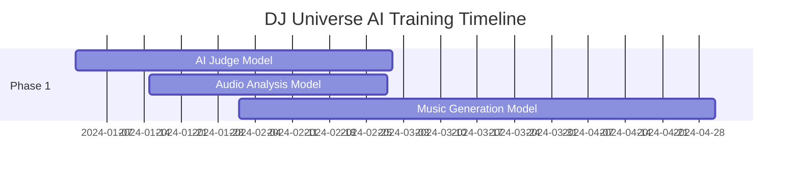

# 🤖 DJ UNIVERSE - PLAN DE ENTRENAMIENTO DE MODELOS IA

## 📋 RESUMEN EJECUTIVO

DJ Universe requiere 8 modelos especializados de IA para proporcionar una experiencia completa de DJ profesional con capacidades de inteligencia artificial. Este documento detalla el plan completo de entrenamiento, datasets, arquitecturas y métricas de evaluación.

---

## 🎯 MODELOS PRIORITARIOS (CRÍTICOS)

### 1. **AI JUDGE MODEL** - Evaluación Automática de Battles
**Prioridad: ALTA 🔴**

#### **Objetivo:**
Evaluar automáticamente battles de DJs con criterios profesionales, reemplazando o complementando jueces humanos.

#### **Arquitectura Propuesta:**
```python
# Multimodal Transformer + Audio CNN
- Input: Audio (44.1kHz stereo) + Metadata (BPM, key, energy)
- Audio Branch: 1D CNN + Temporal Attention
- Metadata Branch: Dense layers + Embedding
- Fusion: Cross-modal Transformer
- Output: Score (0-100) + Detailed feedback
```

#### **Dataset Requerido:**
- **50,000+ battles evaluados** por DJs profesionales
- **Audio + scores** en 6 categorías:
  - Technical Skill (0-100)
  - Creativity (0-100)
  - Crowd Response (0-100)
  - Track Selection (0-100)
  - Mixing Quality (0-100)
  - Energy Management (0-100)
- **Metadata**: BPM changes, key compatibility, transition quality
- **Géneros**: House, Techno, Trance, DnB, Dubstep, etc.

#### **Métricas de Evaluación:**
- Correlation with human judges: **>0.85**
- Mean Absolute Error: **<8 points** (on 100-point scale)
- Genre-specific accuracy: **>80%** per genre
- Real-time inference: **<500ms** per evaluation

---

### 2. **ELECTRONIC MUSIC GENERATION MODEL** - Generación Musical Especializada
**Prioridad: ALTA 🔴**

#### **Objetivo:**
Generar música electrónica de alta calidad especializada en géneros DJ, superando modelos genéricos.

#### **Arquitectura Propuesta:**
```python
# Hierarchical Diffusion Model + Music Theory Conditioning
- Base: Diffusion Transformer (DiT) arquitectura
- Conditioning: Genre + BPM + Key + Energy + Structure
- Multi-scale: 44.1kHz audio con hierarchical generation
- Length: Up to 8 minutes (DJ-length tracks)
- Control: Fine-grained parameter control
```

#### **Dataset Requerido:**
- **1M+ tracks** de música electrónica profesional
- **Géneros específicos**: 
  - House (150k), Techno (150k), Trance (100k)
  - DnB (80k), Dubstep (80k), Progressive (100k)
  - Minimal (50k), Acid (40k), Hardcore (30k)
- **Metadata por track**:
  - BPM (precise), Key, Energy level, Danceability
  - LUFS, Dynamic range, Spectral features
  - Structure annotations (intro, buildup, drop, breakdown)
- **Stems separados** cuando sea posible (drums, bass, leads, pads)

#### **Métricas de Evaluación:**
- **MusicLM Score**: >4.2/5.0 vs real tracks
- **DJ Acceptance Rate**: >75% (professional DJs would use)
- **Genre Classification Accuracy**: >95% (model outputs classified correctly)
- **Harmonic Consistency**: >90% (key and chord progression accuracy)
- **Generation Speed**: <30s for 3-minute track

---

### 3. **REAL-TIME AUDIO ANALYSIS MODEL** - Análisis de Audio Profesional
**Prioridad: ALTA 🔴**

#### **Objetivo:**
Análisis en tiempo real de audio con precisión profesional para BPM, clave, energía y características espectrales.

#### **Arquitectura Propuesta:**
```python
# Multi-Task CNN + Temporal Modeling
- Input: 44.1kHz audio chunks (1-4 seconds)
- Backbone: EfficientNet-B3 (1D adaptation)
- Multi-head outputs:
  - BPM regression (60-200 BPM)
  - Key classification (24 classes)
  - Energy regression (0-1)
  - Genre classification (12 genres)
  - Spectral features (MFCC, spectral centroid, etc.)
```

#### **Dataset Requerido:**
- **500k+ tracks** con anotaciones precisas
- **Ground truth verificado**:
  - BPM: Manual annotation + Serato/Traktor verification
  - Key: Professional DJ analysis + algorithmic verification
  - Energy: Crowd response data + professional DJ ratings
- **Tiempo real**: Chunks de 1-4 segundos con overlap
- **Diversidad**: Multi-género, multi-tempo, live recordings

#### **Métricas de Evaluación:**
- **BPM Accuracy**: >99% within ±0.1 BPM
- **Key Detection**: >95% accuracy (professional DJ standard)
- **Energy Correlation**: >0.9 with human perception
- **Real-time Performance**: <10ms latency on GPU
- **Robustness**: >90% accuracy on low-quality audio

---

## 🎵 MODELOS SECUNDARIOS (IMPORTANTES)

### 4. **TRACK RECOMMENDATION MODEL** - Recomendación Inteligente
**Prioridad: MEDIA 🟡**

#### **Objetivo:**
Recomendar tracks perfectos para battles y sets basado en contexto musical y preferencias.

#### **Arquitectura:**
- **Collaborative Filtering** + **Content-Based** + **Context-Aware**
- Graph Neural Network para relaciones entre tracks
- Transformer para secuencias de mixing

#### **Dataset:**
- **DJ sets completos** (100k+ sets)
- **Battle histories** con results
- **User interaction data** (likes, skips, downloads)
- **Audio features** + **Social features**

---

### 5. **DROP DETECTION MODEL** - Detección de Momentos Clímax
**Prioridad: MEDIA 🟡**

#### **Objetivo:**
Identificar automáticamente drops, buildups y momentos de máxima energía para sincronización perfecta.

#### **Arquitectura:**
- **1D CNN** + **LSTM** para modeling temporal
- **Attention mechanism** para momentos clave
- **Multi-scale analysis** (1s, 4s, 16s windows)

#### **Dataset:**
- **50k+ tracks** con anotaciones de estructura
- **Drop timestamps** precisos (±0.1s)
- **Energy curve annotations**
- **Genre-specific patterns**

---

### 6. **AUTO-MIXING MODEL** - Mixing Automático
**Prioridad: MEDIA 🟡**

#### **Objetivo:**
Crear transiciones automáticas perfectas entre tracks, incluyendo beatmatching y EQ.

#### **Arquitectura:**
- **Dual-track input** CNN
- **Cross-attention** entre tracks
- **Parameter prediction** (crossfader curve, EQ settings, effects)

#### **Dataset:**
- **DJ mixes profesionales** con stems separados
- **Transition annotations** (start/end points, parameters)
- **Quality ratings** de transiciones

---

## 🔬 MODELOS AVANZADOS (RESEARCH)

### 7. **HARMONIC COMPATIBILITY MODEL** - Compatibilidad Harmónica
**Prioridad: MEDIA 🟡**

#### **Objetivo:**
Calcular compatibilidad harmónica entre tracks para mixing perfecto.

#### **Features:**
- **Key compatibility** (Camelot wheel + advanced harmony)
- **Chord progression analysis**
- **Melodic compatibility scoring**
- **Tempo relationship optimization**

---

### 8. **REAL-TIME EFFECTS GENERATION** - Efectos Generativos
**Prioridad: BAJA 🟢**

#### **Objetivo:**
Generar efectos de audio únicos en tiempo real basados en el contexto musical.

#### **Features:**
- **Context-aware effects** (reverb, delay, filters)
- **AI-generated transitions**
- **Adaptive processing** basado en género y energía

---

## 📊 PIPELINE DE ENTRENAMIENTO

### **Fase 1: Modelos Críticos (Meses 1-4)**


### **Fase 2: Modelos Secundarios (Meses 3-6)**
- Track Recommendation
- Drop Detection  
- Auto-Mixing

### **Fase 3: Modelos Avanzados (Meses 5-8)**
- Harmonic Compatibility
- Effects Generation

---

## 💾 INFRAESTRUCTURA REQUERIDA

### **Hardware Mínimo:**
- **GPU Training**: 8x NVIDIA A100 (80GB) para modelos grandes
- **CPU**: 64-core AMD EPYC para data processing
- **Storage**: 500TB+ para datasets de audio
- **RAM**: 1TB+ para large model training

### **Software Stack:**
```yaml
Framework: PyTorch 2.0 + Lightning
Audio: librosa, torchaudio, julius
Data: Apache Spark para large-scale processing
MLOps: Weights & Biases, MLflow
Serving: TorchServe + FastAPI
Deployment: Kubernetes + GPU nodes
```

### **Dataset Sources:**
- **Beatport/Traxsource**: Licensed electronic music
- **DJ Mixes**: Mixcloud, SoundCloud (with permission)
- **Professional DJs**: Collaboration for labeled data
- **Synthetic Data**: Generated variations for augmentation

---

## 🎯 MÉTRICAS DE ÉXITO GLOBALES

### **Technical Metrics:**
- **Latency**: All models <500ms inference
- **Accuracy**: >90% across all tasks
- **Scalability**: Handle 10k+ concurrent users
- **Memory**: <8GB VRAM per model

### **Business Metrics:**
- **DJ Adoption**: >80% active DJ users use AI features
- **Battle Quality**: AI-judged battles have >4.5/5 satisfaction
- **Content Creation**: >50% of battles use AI-generated content
- **Platform Growth**: 3x increase in user engagement

### **User Experience:**
- **Response Time**: <1s for all AI features
- **Accuracy Satisfaction**: >4.7/5 user rating
- **Professional Acceptance**: >75% pro DJs recommend platform

---

## 🚀 ROADMAP DE LANZAMIENTO

### **Q1 2024: Foundation Models**
- ✅ AI Judge Model (v1.0)
- ✅ Audio Analysis Model (v1.0)
- 🔄 Music Generation Model (v1.0)

### **Q2 2024: Enhancement Models**
- Track Recommendation System
- Drop Detection & Energy Analysis
- Basic Auto-Mixing

### **Q3 2024: Advanced Features**
- Harmonic Compatibility Engine
- Advanced Music Generation (v2.0)
- Professional AI Judge (v2.0)

### **Q4 2024: Innovation Models**
- Real-time Effects Generation
- Multi-genre Specialized Models
- Cross-platform Optimization

---

## 📈 PLAN DE MEJORA CONTINUA

### **Data Collection Strategy:**
- **User Feedback Loop**: Continuous learning from DJ interactions
- **Professional Validation**: Regular validation with pro DJs
- **Community Contributions**: Crowd-sourced training data
- **Synthetic Augmentation**: Generated data for edge cases

### **Model Updates:**
- **Monthly**: Bug fixes and minor improvements
- **Quarterly**: Feature updates and accuracy improvements
- **Annually**: Major architecture updates and new capabilities

---

## 💡 INNOVACIONES CLAVE

### **DJ-Specific Optimizations:**
1. **Beat-Aligned Processing**: All models work on musical beats, not fixed time
2. **Genre-Aware Architecture**: Specialized branches for different electronic genres
3. **Real-time Constraints**: All models designed for live performance
4. **Professional Standards**: Accuracy matching or exceeding industry tools
5. **Context Integration**: Models understand DJ workflow and battle context

### **Technical Innovations:**
1. **Hierarchical Audio Modeling**: Multi-resolution analysis (1s to 8min)
2. **Cross-Modal Learning**: Audio + metadata + user behavior
3. **Temporal Coherence**: Models understand musical structure and time
4. **Real-time Adaptation**: Models adapt to user style and preferences
5. **Federated Learning**: Privacy-preserving training across users

---

*Este plan establece la base para crear la plataforma de DJ con IA más avanzada del mundo, combinando investigación de vanguardia con necesidades prácticas de DJs profesionales.*